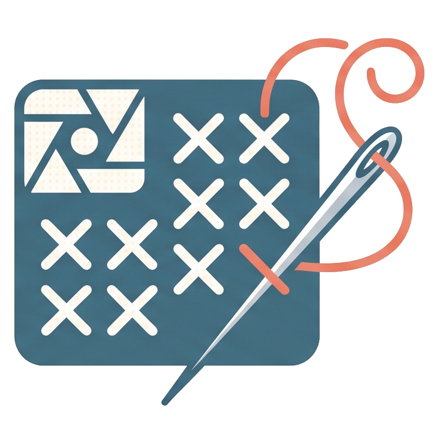

<div align="center">

  

  # 🧵 StitchGrid Studio
  
  **Transform physical cross-stitch scans & charts into normalized, pristine pixel art matrices.**

  [](https://bun.sh)
  [](https://developer.mozilla.org/en-US/docs/Web/API/Canvas_API)
  [](#-privacy--performance)
  [](LICENSE)
  [](#)


</div>

---

## 💡 The Problem & Solution

Traditional scanned cross-stitch patterns suffer from scan rotation, distorted grid lines, printed black symbols (`+`, `×`, `•`, letters), fabric texture, and color bleed. Re-creating them manually in pixel art software is tedious and error-prone.

**StitchGrid Studio** automates this reconstruction right in the browser:

| Challenge in Scanned Charts | How StitchGrid Studio Solves It |
| :--- | :--- |
| **Perspective & Skewed Grid** | Interactive **2-Point Calibration** with a $5\times$ zoom reticle loupe snaps origin and cell size instantly. |
| **Grid Lines & Paper Bleed** | **Trimmed-Mean Sampling** extracts colors only from the inner region of each cell (e.g. middle 60%). |
| **Black Printed Chart Symbols** | **Luminosity Filtering** automatically discards the darkest pixels to preserve true thread color. |
| **Scan Color Variations** | **Euclidean $\Delta E$ Clustering** groups thousands of micro-variations into discrete thread shades. |
| **Manual Touch-ups** | Built-in **Brush, Eraser, Auto-Background Detection**, and **Palette Remapper**. |

---

## ✨ Key Features

### 🎯 1. Sub-Pixel 2-Point Calibration
- **Two-Click Alignment**: Click the top-left intersection `(0, 0)` and bottom-right intersection `(cols, rows)`.
- **$5\times$ Floating Reticle Loupe**: High-precision magnifying reticle with real-time coordinate readouts.
- **Draggable Pins**: Reposition calibration points dynamically to adjust cell dimensions (`cellW`, `cellH`) and origin (`offsetX`, `offsetY`).

### 🎛️ 2. Micro-Tuning & High-Vis Overlay
- **Arrow Navigation**: Adjust grid offset with micro precision (`0.25px`, `0.5px`, `1.0px`).
- **Scale Morphing**: Expand or contract cell width and height dynamically with `Shift + Arrows`.
- **Fluorescent Palettes**: Switch overlay grid lines between High-Vis Pink, Electric Cyan, Emerald Green, Amber Yellow, and Crisp White.
- **10×10 Grid Guides**: Highlight every 10th line to match physical chart numbering.

### 🧪 3. Mathematical Color Extraction Engine
- **Central Core Sampling**: Bypasses printed grid lines by sampling only the central percentage of each stitch.
- **Symbol Rejection Filter**: Sorts pixels by luminance and discards printed ink markings (crosses, arrows, asterisks).
- **Asynchronous Batching**: Frame-budgeted processing loop prevents UI freezing even on huge patterns ($100\times100$+).

### 🎨 4. Palette Remapping & Pixel Art Touch-Up
- **Palette Inspector**: Lists clustered colors by frequency, count, and percentage coverage.
- **Interactive Highlight**: Hover any swatch to highlight all corresponding cells across the canvas.
- **Native Color Remapping**: Click any cluster swatch to reassign a clean digital hex color.
- **Auto-Background Removal**: Detects the fabric or unstitched canvas with one click and marks it transparent.
- **Canvas Tools**:
  - 🔍 **Inspector**: Real-time cursor coordinates and hex color readouts.
  - 🖌️ **Paintbrush**: Paint cells with any selected palette cluster.
  - 🧹 **Eraser**: Mark individual cells as empty / transparent background.

### 👁️ 5. Dual & Comparison View Modes
- **Mode 1 — Alignment Grid (`1`)**: Inspect scan alignment against the overlay grid.
- **Mode 2 — Pixel Art (`2`)**: Render the crisp, reconstructed pixel art matrix.
- **Mode 3 — Split / Compare (`3`)**: Overlay original scan and pixel art with a smooth alpha-blending slider.

### 💾 6. Multi-Resolution Export
- **Scalable PNG**: Export native 1:1 ($1\text{px}/\text{cell}$), $4\times$, $8\times$, $16\times$, or $24\times$ presentation quality.
- **Gridline Overlay**: Optional crisp cell boundary rendering.
- **Clipboard Instant Copy**: One-click PNG copy to clipboard for direct pasting into Aseprite, Photoshop, or Discord.
- **Structured JSON Matrix**: Exports full 2D array matrix with dimensions, palette color maps, and cell assignments.

---

## ⌨️ Keyboard Shortcuts

> [!TIP]
> Press <kbd>?</kbd> anywhere in the application to toggle the interactive cheat sheet modal.

| Category | Shortcut | Description |
| :--- | :--- | :--- |
| **Grid Offset** | <kbd>←</kbd> <kbd>→</kbd> <kbd>↑</kbd> <kbd>↓</kbd> | Shift grid offset ($X$ / $Y$) by current tuning step |
| **Cell Scale** | <kbd>Shift</kbd> + <kbd>←</kbd> <kbd>→</kbd> | Contract / Expand Cell Width |
| **Cell Scale** | <kbd>Shift</kbd> + <kbd>↑</kbd> <kbd>↓</kbd> | Contract / Expand Cell Height |
| **Micro-Tune** | <kbd>Alt</kbd> + Arrows | Force ultra-fine ($0.01\text{px}$ / $0.05\text{px}$) stepping |
| **Viewport** | <kbd>Space</kbd> + Drag | Pan across large high-res scans |
| **Zoom** | <kbd>Mouse Wheel</kbd> | Zoom in / Zoom out centered on cursor position |
| **Clipboard** | <kbd>Ctrl</kbd> + <kbd>V</kbd> | Paste image directly from system clipboard |
| **View Mode** | <kbd>1</kbd> / <kbd>2</kbd> / <kbd>3</kbd> | Switch: Alignment Grid / Pixel Art / Compare |
| **Help** | <kbd>?</kbd> | Toggle shortcuts dialog |

---

## 🔒 Privacy & Performance

> [!NOTE]
> **Zero Network Uploads**: All image parsing, pixel sampling, canvas rendering, and color clustering run **100% locally** in your browser using the HTML5 2D Canvas API. Your patterns and scanned designs never leave your machine.

---


## 🚀 Quick Start

### Prerequisites
- [Bun](https://bun.sh) (v1.0.0 or higher)

### Run Locally

1. **Clone the repository**:
   ```bash
   git clone https://github.com/redystum/Stitch-Converter.git
   cd Stitch-Converter
   ```

2. **Start the server with Bun**:
   ```bash
   bun server.js
   ```

3. **Open in browser**:
   ```text
   http://localhost:3003
   ```

*(To run on a custom port: `PORT=8080 bun server.js`)*

---

## 📄 License

This project is open-source and available under the terms of the [MIT License](LICENSE).  
